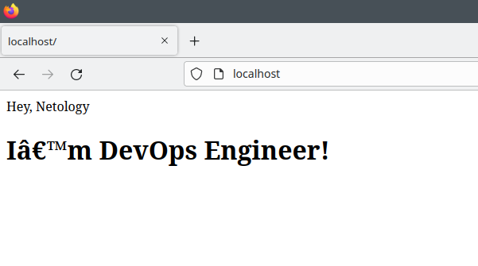
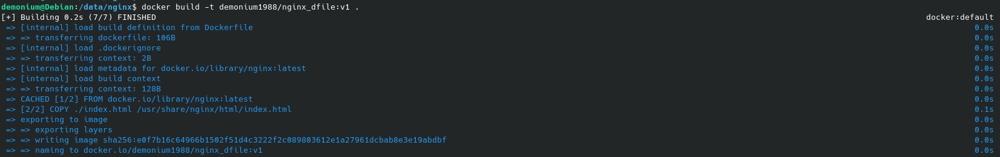

# Автор: Федорчук Дмитрий Сергеевич DEVOPS-33

# Домашнее задание к занятию 3. «Введение. Экосистема. Архитектура. Жизненный цикл Docker-контейнера»

## Задача 1

Сценарий выполнения задачи:

- создайте свой репозиторий на https://hub.docker.com;
- выберите любой образ, который содержит веб-сервер Nginx;
- создайте свой fork образа;
- реализуйте функциональность:
запуск веб-сервера в фоне с индекс-страницей, содержащей HTML-код ниже:
```
<html>
<head>
Hey, Netology
</head>
<body>
<h1>I’m DevOps Engineer!</h1>
</body>
</html>
```

Опубликуйте созданный fork в своём репозитории и предоставьте ответ в виде ссылки на https://hub.docker.com/username_repo.

## Решение 1

* Создал свой репозиторий на Docker Hub. https://hub.docker.com/u/demonium1988
* Выбрал стандартный репозиторий nginx и версию latest
* Запускаю выбранный образ командой
```
docker run -d --restart always --name nginx_netology -p 80:80 -v /var/www/html:/usr/share/nginx/html nginx:latest
```
где

```docker run -d``` - запускает контейнер в фоне

```--restart always``` - политика перезапуска контейнера не зависимо от его состояния

```--name nginx_netology``` - заданное мной вручную название контейнера

```-p 80:80``` - порт, по которому будет доступен контейнер

```/var/www/html``` - директория на хостовой машине, в которой содержится индексная страница

```/usr/share/nginx/html``` - директория внутри контейнера, куда прокидывается директория с индексной страницей из хостовой машины

```nginx:latest``` - сам выбранный и запускаемый образ и его версия




Также можно использовать Dockerfile следующего содержания:

```
FROM nginx:latest
COPY /var/www/html/index.html /usr/share/nginx/html/index.html
```

Выполняю сборку образа:



Запускаю контейнер используя созданный образ:


Открываю браузер и перехожу по адресу ```localhost/```, порт можно не указывать т.к. контейнер запущен для использования на 80 порту. Результат будет таким же, как и без запуска контейнера вручную, то есть без использования Dockerfile.


* Публикую созданные образы в собственном репозитории в Docker Hub.

Для этого авторизуюсь в Docker Hub:


Задаю тег для образа и загружаю его в репозиторий на Docker Hub:


Ссылки на репозитории:

https://hub.docker.com/r/demonium1988/nginx_netology

https://hub.docker.com/r/demonium1988/nginx_dfile

## Задача 2

Посмотрите на сценарий ниже и ответьте на вопрос:
«Подходит ли в этом сценарии использование Docker-контейнеров или лучше подойдёт виртуальная машина, физическая машина? Может быть, возможны разные варианты?»

Детально опишите и обоснуйте свой выбор.

--

Сценарий:

- высоконагруженное монолитное Java веб-приложение;
- Nodejs веб-приложение;
- мобильное приложение c версиями для Android и iOS;
- шина данных на базе Apache Kafka;
- Elasticsearch-кластер для реализации логирования продуктивного веб-приложения — три ноды elasticsearch, два logstash и две ноды kibana;
- мониторинг-стек на базе Prometheus и Grafana;
- MongoDB как основное хранилище данных для Java-приложения;
- Gitlab-сервер для реализации CI/CD-процессов и приватный (закрытый) Docker Registry.

## Решение 2
- высоконагруженное монолитное Java веб-приложение - поскольку есть условие монолитности приложения, использование Java в Docker контейнере не подходит. Больше подойдет отдельный физический сервер. 
- Nodejs веб-приложение - Node.js – это кроссплатформенная среда для разработки клиентских приложений, в основе которой лежит язык программирования JavaScript. Docker можно использовать для запуска JDK. А само написанное приложение можно упаковать в Docker-контейнер и загрузить в Docker Hub. Таким образом Docker можно применять для хранения и распространения написанного Node.js приложения, а также для более удобного запуска Java.
- мобильное приложение c версиями для Android и iOS - для сборки и запуска Backend части приложения на Android и iOS Docker-контейнеры подойдут, но для запуска Frontend части приложения подойдет не всегда, т.к. в контейнерах нет UI или иного графического вывода.
- Elasticsearch-кластер для реализации логирования продуктивного веб-приложения — три ноды elasticsearch, два logstash и две ноды kibana:

Elasticsearch используется для хранения, анализа, поиска логов приложений.

Kibana представляет из себя удобную Web панель с дашбордами для работы с поступившими логами.

Logstash сервис для сбора логов и отправки их в Elasticsearch. Используется как удобное связующее звено между Elasticsearch и Kibana. 

В этом сценарии можно использовать как отдельные серверы либо виртуальные машины, так и Docker контейнеры. Но поскольку указано условие логирования продуктивного веб-приложения, которое будет сильно нагруженным и этим приложением будут пользоваться множество клиентов, то считаю, что лучше использовать Doсker контейнеры. Их использование потребует меньше ресурсов, чем виртуальная машина. Также Docker контейнеры обеспечат изоляцию нод друг от друга и все ноды можно будет разместить на одном сервере. Если использовать физические серверы, то при указанных условиях потребуется несколько серверов, то есть индивидуальный физический сервер под каждую ноду.

- мониторинг-стек на базе Prometheus и Grafana - можно устанавливать на физические или виртуальные машины, но гораздо удобнее запускать из Docker образов. Сами системы довольно легковесные, но им может понадобиться много пространства на жестком диске для сбора и хранения метрик. Параметры приложений и подключаемые директории, а также время хранения метрик можно удобно описать в docker-compose файлах. Также используя docker compose можно легко менять параметры Prometheus и Grafana либо масштабировать их.
- MongoDB как основное хранилище данных для Java-приложения:

MongoDB — это служба баз данных NoSQL с высокой производительностью и возможностью масштабирования. Он использует модель хранения, подобную JSON, и не требует предопределенной схемы базы данных. MongoDB можно запустить и использовать в Docker контейнере. При запуске MongoDB из Docker контейнера одной из основных проблем является хранилище. Хорошей практикой является использование томов, чтобы гарантировать сохранение данных даже после остановки контейнера или перезапуска демона Docker. При запуске MongoDB из Docker контейнера нужно монтировать директорию хостовой машины как том контейнера.
- Gitlab-сервер для реализации CI/CD-процессов и приватный (закрытый) Docker Registry - возможна установка и запуск этих систем как на виртуальных и физических машинах, так и на Docker контейнерах. Мне кажется более безопасным способом использование виртуальных машин с созданием резервных копий по расписанию и хранению этих копий в течении определенного времени, т.к. Git и Docker репозитории могут содержать очень важные данные, например, исходные коды приложений. Также приватный Docker Registry не стоит выкладывать в публичный Docker Hub или куда-то еще в интернет.

## Задача 3

- Запустите первый контейнер из образа ***centos*** c любым тегом в фоновом режиме, подключив папку ```/data``` из текущей рабочей директории на хостовой машине в ```/data``` контейнера.
- Запустите второй контейнер из образа ***debian*** в фоновом режиме, подключив папку ```/data``` из текущей рабочей директории на хостовой машине в ```/data``` контейнера.
- Подключитесь к первому контейнеру с помощью ```docker exec``` и создайте текстовый файл любого содержания в ```/data```.
- Добавьте ещё один файл в папку ```/data``` на хостовой машине.
- Подключитесь во второй контейнер и отобразите листинг и содержание файлов в ```/data``` контейнера.

## Решение 3

* Запускаю первый контейнер из образа ***centos*** c тегом latest в фоновом режиме с подключенной директорией ```/data```:


* Запускаю второй контейнер из образа ***debian*** c тегом latest в фоновом режиме с подключенной директорией ```/data```:


* Подключаюсь к первому контейнеру и создаю текстовый файл в директории ```/data```:


* Добавляю ещё один файл в папку ```/data``` на хостовой машине:


* Подключаюсь во второй контейнер и проверяю содержимое файлов в директории ```/data``` контейнера:


Файлы одинаковые как в контейнерах, так и на хостовой машине. Делаю вывод, что подключение директории хостовой машины (флаг -v или --volume) к контейнеру выполнено успешно, к тому же хостовая директория может быть общей для нескольких контейнеров.  

## Задача 4 (*)

Воспроизведите практическую часть лекции самостоятельно.

Соберите Docker-образ с Ansible, загрузите на Docker Hub и пришлите ссылку вместе с остальными ответами к задачам.

## Решение 4

Поскольку в лекции уже был предоставлен листинг Dockerfile с запуском Ansible, то буду использовать именно его.

Рассмотрим, что происходит при выполнении  Dockerfile:

```FROM alpine:3.14``` - директива FROM указывает какой базовый образ дистрибутива использовать для работы. В качестве базового образа выбран Alpine Linux с тегом или версией 3.14.

```RUN  CARGO_NET_GIT_FETCH_WITH_CLI=1 && \ ...``` - в этом блоке в директиве RUN разрешаются использование git исполняемого файла для получения индексов и зависимостей git, устанавливаются необходимые пакеты, например, python3 и его зависимости, далее в самом python устанавливаются необходимые для работы Ansible модули и сам Ansible. В завершении блока очищается программный и файловый кэш, который был создан при установке. Все команды будут выполняться внутри выбранного в инструкции FROM дистрибутива Alpine Linux. 

```RUN  mkdir /ansible && \ ...``` - в этом блоке в директиве RUN создаются рабочая директория Ansible для размещения файла конфигурации, а также создается директория для файла с указываем имени хоста для Ansible.

```WORKDIR /ansible``` - директива WORKDIR задает рабочую директорию Ansible.

```COPY ansible.cfg /ansible/``` - директива COPY копирует файл конфигурации ansible.cfg в созданную ранее директорию /ansible.

```CMD  [ "ansible-playbook", "--version" ]``` - выполняется программа Ansible, в данному случае будет выводиться версия Ansible.

Для сборки образа пришлось внести изменения в Dockerfile, добавить флаг --ignore-installed, так как один из устанавливаемых модулей Python "packaging" уже был установлен и без применения флага сборка образа не могла завершиться корректно.

Проверяю, появился ли собранный образ с Ansible:


Загружаю образ на Docker Hub:


Ссылка на образ: https://hub.docker.com/r/demonium1988/ansible